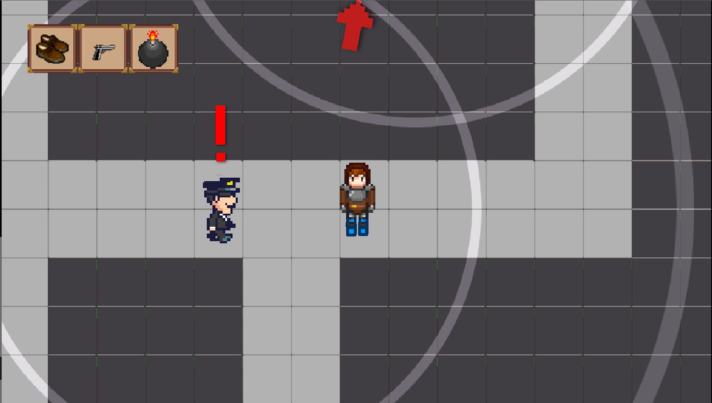

Brull
Documento de diseño de videojuego
---------------------------------------------------------------------------------------------------------------------------------------
Grupo 4 (Grupo Jodas Errantes)
Adrià Carreras Bagur | David Rodríguez Gómez
Oscar Maya Jiménez
Javier Meitín Moreno | Sebastián Sánchez-Hombría
Resumen
Géneros: Acción, Sigilo.
Modos: Un jugador.
Público Objetivo:
(+18), Para cualquier persona. todos español
Plataformas: PC.

Descripción: Brull es un videojuego web top-down del género de acción y sigilo en el que el jugador debe realizar un ataque terrorista contra la Familia Real, siguiendo distintas fases dentro del nivel, escogiendo diferentes objetos que pueden ayudar a conseguir el éxito.
Páginas de interés
Página web: https://jmeitin.github.io/JODAS-errantes/
Repositorio: https://github.com/jmeitin/JODAS-errantes
Twitter: https://twitter.com/JODASerrantes
Pivotal: https://www.pivotaltracker.com/n/projects/2467974	

### Índice
ASPECTOS GENERALES	3
MENÚS Y MODOS DE JUEGO	3
Menús y modos de juego	3
Menú Principal:	3
Menú In Game (de pausa):	3
Interfaz y control	4
JUGABILIDAD:	5
Mecánicas	5
Jugador:	5
Selección de objetos:	5
Objetos:	5
Los policías:	5
Los civiles:	6
Familia real:	6
Dinámicas	6
Contenidos:	7
Relato breve de una partida:	7

												

### ASPECTOS GENERALES
Experiencia: Se pretende el entretenimiento del usuario sin la intención de enviar ningún mensaje ideológico. El objetivo es meramente lúdico. No se pretende dañar directa o indirectamente la memoria de las víctimas del terrorismo.
Claves estéticas: Los colores y diseños tanto del entorno como de los personajes son apagados y reflejan los sentimientos y descripción que da Baroja en su novela.
Narrativa: El terrorista Brull pretende atentar contra los reyes de España, que se encuentran en la Calle Mayor de Madrid. El terrorista deberá de realizar los preparativos previos, ya sea recolectar materiales para la creación de la bomba, el acercarse al lugar del atentado.
Tema: El terrorismo y anarquismo.
Ambientación: Madrid, 1906. El atentado anarquista del 31 de mayo en contra de la Familia Real.
Dinámica: El jugador vaga por las calles de Madrid hasta llegar al lugar indicado para tirar la bomba. En caso de conseguirlo, deberá huir sin que le atrape la policía.

### MENÚS Y MODOS DE JUEGO
Modos de juego: El único modo de juego disponible es el modo de un solo jugador, en el que éste podrá jugar las veces que quiera, ya sea por completar el juego de formas distintas o intentar obtener la máxima puntuación posible.
Menús y modos de juego
Habrá dos menús dentro del juego:
Menú principal: Es el menú que aparece al iniciar el juego.
Menú In Game: Es el menú que aparece al pausar la partida.
Menú Victoria/Derrota: Es el menú que aparece al ganar o perder la partida.

## Menú Principal:  
En este menú nos encontramos los siguientes botones:
Comenzar: Comienza una partida, enviando al jugador a la pantalla de la fase 1 del juego.
Sonido: Podrá configurar el volumen.
Créditos: Muestra en una pantalla los integrantes del grupo que han desarrollado el juego.

## Menú In Game (de pausa):  
A este menú se accede pulsando la tecla P durante una partida. Consta de tres opciones diferentes:
Continuar: El jugador continúa con la partida que está realizando.
Música: El jugador ajusta la intensidad de la música con botones para aumentarla o disminuirla.
Salir: Se acaba la partida, devolviendo al jugador al Menú Principal.
Menú Victoria/Derrota:  
A este menú se accede usando la pistola, ganando o perdiendo la partida. Consta de una única opción:
Continuar: El jugador vuelve al menú principal.

### Interfaz y control

## Controles:  
Los controles del juego van a ser los siguientes:
Flechas/WASD: desplaza al jugador en horizontal, vertical o diagonal.
Números: selección de un objeto del inventario que lleva el jugador.
Ratón: selección de objetos para el nivel, interacción con los menús, selección y deselección del lugar de tirar la bomba.
P: pausar la partida.
Espacio: botón de acción (por ejemplo, lanzar la bomba).

## Interfaz:  
Fase 1 (Preparación): Los objetos entre los que puede escoger el jugador aparecen encima de una mesa. Si el jugador pasa el ratón por encima de uno aparecerá un cuadro de texto con la información del objeto y su peso. Si hace click en el objeto se transparenta y se suma su peso a un contador que se encuentra en la parte superior derecha de la pantalla. Si vuelve a hacer click encima de un objeto transparentado, se resta su peso del contador  y el objeto en la mesa recupera su tono original (estaba transparentado al estar seleccionado). En la zona superior derecha de la pantalla hay un indicador (como ya se ha mencionado) con el peso máximo que tenemos comparado con el peso de todos los objetos que llevamos seleccionados actualmente, indicado como fracción(2/5 kg, p.ej.) Si quieres seleccionar un objeto que supera el peso máximo, el juego no te permitirá cogerlo hasta que elimines un objeto.
En la zona inferior derecha de la pantalla habrá un botón de continuar (se trata de una flecha), que llevará al jugador, si tiene un peso inferior o igual al máximo, pasa a la siguiente fase del juego.
Fase 2 (Previa): En la zona superior izquierda de la pantalla habrá una barra con los objetos que lleva el jugador idéntica a la de la fase anterior. Habrá una flecha en el borde de la pantalla señalando la dirección en la que está el objetivo del jugador, y cuando esté el jugador cercano al objetivo, y estén los dos en la pantalla simultáneamente, la flecha señalará el lugar exacto del objetivo.
Fase 3 (Bomba): El jugador ve la calle desde el tejado. Hay un punto que se mueve con el ratón que es el centro de la explosión. El jugador puede seleccionar el punto de la calle donde explota la bomba moviendo el ratón y haciendo click izquierdo. Al hacer click el rango de la bomba se empieza a mover de arriba a abajo y se queda quieto cuando se deja de hacer click izquierdo, y dependiendo de cómo haya quedado tendrá más o menos radio de explosión (al principio tiene el radio original de la bomba y va creciendo hasta un máximo del rango más 0,5, cuando se pasa vuelve al radio original). Por la calle marcha un convoy de civiles guardando la carroza del rey en el centro, el objetivo es acabar con la carroza.

### JUGABILIDAD:
## Mecánicas
# Jugador:
Muerte: Muere si lo atrapan o si se suicida en la fase 2.
Movimiento: El jugador se mueve en 4 direcciones.

## Selección de objetos:
Los objetos a seleccionar se presentan al jugador en una habitación. Para seleccionar alguno que llevar en la misión solo hay que hacer click encima de este. El objeto seleccionado se pondrá de un color distinto (más oscuro), y se tendrá en cuenta su peso para el máximo de objetos que el jugador puede llevar consigo.
Además hay un botón para iniciar la siguiente fase el cual solo se puede pulsar si tienes el peso máximo o menos.

## Objetos:
Cuanto menos peso lleves más puntuación tienes al final.

# Poco peso [1] → Un uso (activo) o pasivos con bufos menores:
Pistola [Activo]: Es un objeto “trampa”, que incita al jugador a usarlo, por su aparente utilidad, pero si el jugador lo activa el personaje se pega un tiro. Además, si la policía captura al jugador, en lugar de ser capturado se suicida (sin más diferencias). 
Potenciador extra de la bomba [Pasivo]: Más radio en la explosión y más difícil de ocultar, haciendo más fácil el minijuego de la Fase 3, pero aumentando el radio de detección por los civiles y policías (+  % radio explosión, +  % radio visión).
Modificador de bomba pequeña [Pasivo]: Menos radio de explosion, pero se reducen las sospechas hacia ti (-  % radio explosión, -  % radio visión). 

# Peso medio [2] → Objetos activos con múltiples usos y objetos pasivos con bufos que afecten de forma notable a la dificultad del juego:
Zapatillas [Pasivo]: Aumenta la velocidad de movimiento (+  %).

# Peso tocho [3] → Activos con usos muy poderosos o pasivos que hacen el juego mucho más fácil:
Sombrero [Activo]: Cambia tu identidad y hace que la policía no se fije en ti. Solo se puede activar cuando te están persiguiendo y no estás dentro del rango visual.
Capa [Pasivo]: Aunque el jugador entre en un rango de sospecha, será más difícil que le detecten (-  % radio visión).

## Los policías:
Los policías son un obstáculo para el jugador. Estos sospechan del jugador en diversas situaciones y atacan si notan algo peligroso. Situaciones de sospecha:
El jugador no lleva ningún objeto que oculte la bomba (capa, modificador de la bomba para hacerla más pequeña). En este caso la sospecha tendrá un rango determinado. Si el jugador se acerca dentro de este rango y está el tiempo suficiente, el policía corre hacia el jugador con intención de arrestar. 

## Rango de sospecha:
Radio en el que si entra el jugador, los policías sospechan de él. Cuando sospeche, se indicará con una interrogación/pitido que irá aumentando su saturación.

## Movimiento:
Los policías siempre estarán en movimiento. Cuando vayan a por el jugador y pierdan el agro internamente los policías seguirán otra dirección aleatoria, para seguir con su ruta de vigilancia.

## Los civiles:
Los civiles son NPCs que se encuentran en las inmediaciones del lugar del atentado. Si el jugador anda cerca de ellos, pueden mirar de arriba a abajo al jugador y suponer que es una persona sospechosa, por lo que avisan a la policía. Cuando entras en contacto con él, avisa a un policía cercano y este se acerca y va a por ti.

## Rango de alerta: Cuando el jugador está casi pegado al civil, este le inspecciona y llama a la policía gritando. El grito llega a una distancia determinada. Al jugador se le aplica la tag “En busca” y la policía le persigue nada más verle.
Movimiento: Los civiles siempre se mueven por un itinerario aleatorio.

## Familia real:
Aparecen en la fase 3 paseando por la calle. Solo aparecen una vez y si el jugador la mata con la bomba, obtiene puntuación extra.

## Dinámicas
El juego consta de tres fases por las que el jugador pasará para poder completar el nivel:
Fase de preparación: En esta fase el jugador debe escoger entre varios objetos y herramientas que le ayudarán en momentos determinados del nivel ofreciendo así alguna ventaja, pero haciendo que no pueda contar con todas ellas al mismo tiempo.
Fase Previa: Ahora que los objetos han sido seleccionados, el jugador deberá llegar hasta el edificio del atentado por las calles de Madrid. En su camino de ida se encontrará con personas, policías y obstáculos físicos (por ejemplo, calles cortadas). Algunos objetos seleccionados en la fase anterior pueden ayudar en esta fase (un sombrero evita que las personas se queden con tu cara por ejemplo).
Fase de la bomba: En esta fase el jugador se posiciona para tirar la bomba. Se sube al tejado del edificio y con una vista de pájaro verá la calle y podrá seleccionar el sitio y el momento en el que tirarla consiguiendo más puntos cuanto más efectiva haya sido la detonación.

## Objetivos
El jugador tiene como objetivo completar el atentado con éxito si completa las tres fases del nivel. En este caso el jugador gana la partida.

## Dificultad
La dificultad es igual para todos los jugadores, no se puede elegir, pero el jugador tiene a su disposición objetos y elementos que le permiten elegir entre si correr un mayor riesgo por mayor puntuación, como ir sin objetos o ir con objetos que no proporcionen ventajas al jugador, o por el contrario jugar de forma más segura. También el cambio entre objetos en el momento justo permitirá que el jugador pueda completar el nivel con más o menos dificultad.

## Recompensas y castigo
El jugador es recompensado con la puntuación y los logros que se obtienen al usar determinados objetos u opciones, y la dificultad, que disminuirá si usamos objetos correctos. El castigo en respuesta a las malas elecciones y acciones del jugador será la muerte, donde el jugador deberá empezar desde el principio cada vez que muera.

## Estética
La ambientación del juego va a ser con temática miserable, representando así la miseria y la ruindad de España en ese momento, que provoca la revolución del protagonista, en busca de una renovación de su país, y por lo tanto haciendo el papel de “héroe” aunque no sea visto así por sus compatriotas.

Las sensaciones que el jugador puede experimentar dentro de una partida es el miedo, cuando nos referimos a que nos pille un policía y nos mate; la incertidumbre, al aparecer en una ciudad desconocida donde el jugador debe pensar cuidadosamente cómo va a afrontar los problemas que están por venir, al tener que adaptar su comportamiento al estilo de juego dependiendo de los objetos equipados; la satisfacción al completar el nivel y poder conseguir logros o objetos nuevos o la decepción de ser vencido dentro del juego teniendo que volver a empezar la partida. La sensación de decepción puede llevar a la desesperación del jugador, aunque también se busca que ésta impulse las ganas por aprender del jugador.

El arte del juego será PixelArt 2D, con una gama de colores más clásicos y con tonos más apagados, para dar sensación de estar en el siglo XX.

El juego está dirigido a personas a partir de los 18 años, ya que es un juego muy violento, en el que se enfoca un tema como es el propio terrorismo y anarquismo.

## Contenidos:
# Historia:
Brull lleva planificando meses el atentado contra la Familia Real. Llega el día 31 de mayo de 1906. Brull coge la bomba y se acerca al lugar del atentado. Tras evitar ser visto por policía y civiles, llega al edificio del atentado. Sube al tejado y lanza la bomba. Desde ese momento Brull deberá escapar de allí ileso.
# Personajes:
Brull: Se trata del protagonista y el personaje que maneja el jugador. Es un terrorista anarquista que su objetivo es realizar la misión de atentar contra la Familia Real y poder eliminarla y cumplir sus objetivos. Sacrificará cualquier cosa con tal de cumplir su objetivo.
Familia Real: Se encuentran realizando un evento oficial en la calle Mayor de Madrid.
Policías: Son los responsables de proteger a la Familia Real de cualquier peligro que les pueda suceder. Se encontrarán en las inmediaciones del lugar del atentado.
Civiles: Son ciudadanos de la ciudad de Madrid que van a ver a la Familia Real.
Espacio: La historia del juego transcurre en dos lugares de Madrid: el lugar de residencia de Brull y las inmediaciones de la calle Mayor.
Tiempo: La historia transcurre el día 31 de mayo de 1906. La duración es de una mañana.
Relato breve de una partida:
El jugador le da a iniciar la partida. Empieza la fase de preparación en la que aparecerá en una habitación donde tendrá que coger los objetos que le pueden ser útiles para realizar el atentado con éxito. Escogeremos el sombrero, y las zapatillas. Cuando tengamos claro los objetos que llevemos, avanzaremos a la fase previa, donde tenemos que llegar al edificio donde fijamos el objetivo del atentado.
El jugador avanzará por las calles con sigilo y precaución. Las zapatillas, como dan velocidad, hacen que vayamos más rápido.
Un policía nos observa con su rango de visión y ya sospecha de nosotros, por lo que vendrá en nuestro camino. Cuando lo haya perdido, utilizará el sombrero para ocultar más su identidad.
Llegará al edificio destino y comenzará la fase de la bomba, donde tendrá que seleccionar dónde tirará la bomba.

### Arquitectura UML

## Plataforma de gestión
La plataforma de gestión que hemos utilizado durante el desarrollo del juego es Pivotal Tracker. Pivotal Tracker es una herramienta de gestión de proyectos ágiles desarrollada por expertos en desarrollo de software ágil. Fácil de usar, Tracker posibilita la colaboración en tiempo real en torno a un registro compartido priorizado.

En esta plataforma hemos organizado las historias de usuario de cada uno de los integrantes, su puntuación, los diferentes hitos, etc.

## Plataforma de comunicación
La plataforma de comunicación que hemos utilizado durante el desarrollo del juego es Telegram. Telegram es una aplicación de mensajería enfocada en la velocidad y seguridad, es súper rápida, simple y gratuita.

En esta plataforma hemos hablado todos los problemas del proyecto, las reuniones de los dailies meetings, comentado aspectos fundamentales del proyecto e ideas relevantes a este.

### Referencias:
## Hitman:
Este juego de sigilo nos recuerda a lo que queremos hacer en las dos primeras fases del juego, con una vista top-down y una jugabilidad lenta y estratégica.

## Grand theft Auto:
El conocido juego de mundo abierto representa un mundo exterior en una gran ciudad con una vista top-down (lo que nos gustaría hacer en la última fase del nivel), aunque con un frenetismo que no buscamos.

## La dama errante:
Esta novela de Pío Baroja es de donde hemos sacado la historia del juego y los nombres de los personajes.

